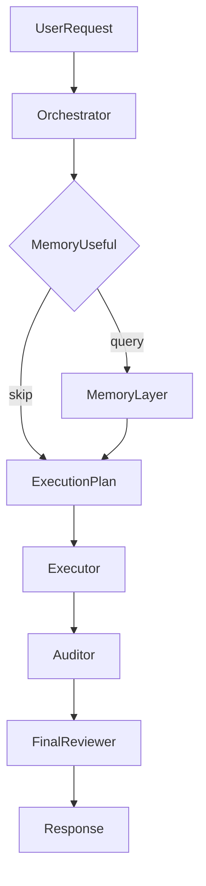

# Architecture

```text
BosskuAI
├── Orchestrator   — understand, detect skill, route models, plan, memory decision
├── Executor       — implement, edit, run commands
├── Auditor        — quality + security + performance + maintainability
├── Final reviewer — completion, risks, next step
├── Memory layer   — markdown + sqlite/vector + optional Postgres/pgvector (Docker MVP)
└── Integrations   — Cursor, Claude Code, Codex, OpenCode (files + rules)
```

## Authoritative sources

| Concern | Where |
|---|---|
| Cross-tool contract | [`AGENTS.md`](../AGENTS.md) |
| Agent playbooks (markdown) | [`agents/`](../agents/) |
| Skill routing data | [`skill-index.json`](../skill-index.json) |
| Memory policy + schema | [`memory/`](../memory/) |
| Docker MVP model routing | [`app/config/bossku_models.php`](../app/config/bossku_models.php) |
| Workspace YAML hints | [`ai-assistant/config/model-router.yaml`](../ai-assistant/config/model-router.yaml) |
| Multi-agent honesty | [`multi-agent-architecture.md`](multi-agent-architecture.md) |
| UI specs (Nuxt) | [`../ui/`](../ui/) |

## Flow (conceptual)



Not every task runs every box — trivial questions should short-circuit (see `AGENTS.md`).

## Production shape

BosskuAI stays **file-first**: rules and skills travel with the repo. The Docker stack is an optional **observable** implementation of the same ideas.
