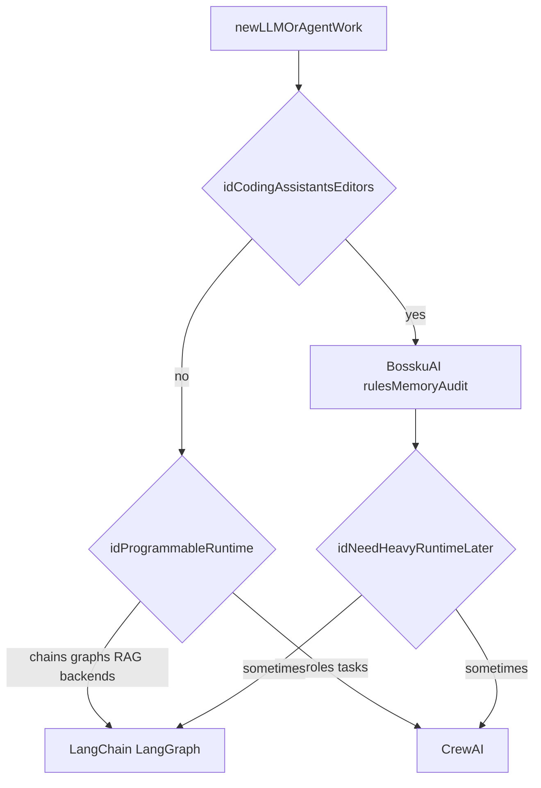

# BosskuAI vs LangChain vs CrewAI

BosskuAI is **not** a replacement for LangChain or CrewAI. They optimize for different jobs.

## Positioning

- **LangChain** shines when you are **building LLM applications** with lots of integrations, chains, retrieval pipelines, or custom runtimes you host.
- **CrewAI** shines when you want **packaged agent crews**, role templates, and higher-level orchestration APIs for exploratory agent workflows.
- **BosskuAI** shines when you are a **software builder using Cursor / Claude / Codex / OpenCode** and want repo-local memory, pragmatic routing rules, auditing discipline, and file-based portability **without adopting a heavyweight framework**.

## Feature comparison (honest)

| Feature | BosskuAI | LangChain | CrewAI |
|---|---|---|---|
| Hosted runtime required | Optional (your Docker MVP) | You build/host | Depends on setup |
| Multi-agent primitives | Editorial patterns + slash commands | Rich chain/graph APIs | First-class crews |
| Vector memory story | Repo scripts + SQLite / pgvector | Integrations-heavy | Depends on tooling |
| Editor integration focus | ✅ rules + markdown | ⚙️ DIY | ⚙️ DIY |
| Library integration breadth | Narrow (by design) | Very broad | Growing |
| Learning curve vs “drop files in repo” | Low-to-medium | Higher for full apps | Medium |

BosskuAI **deliberately stays small**. If you are building production LLM backends with complex tool graphs, use LangChain (or similar). If Bossku-like discipline helps your team but you need programmable orchestration graphs, compose both.

## When to use what

Bossku holds **coding-assistant workflows** together; CrewAI favors **crew-shaped agent runs**; LangChain excels at **graphs, retrieval, tools, and backends you host**.

